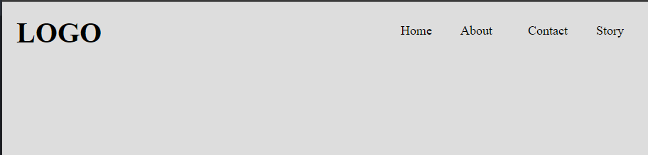
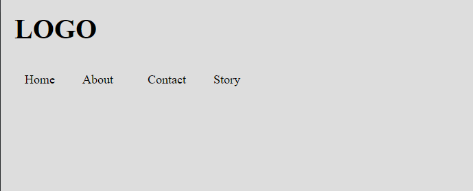
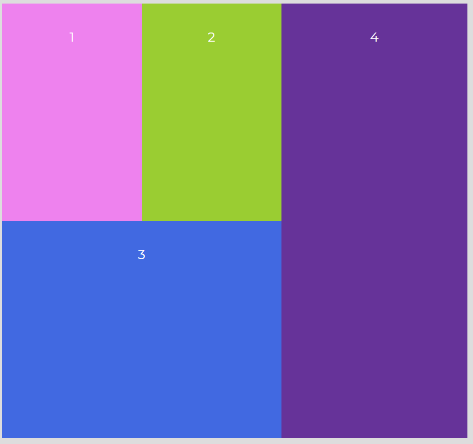
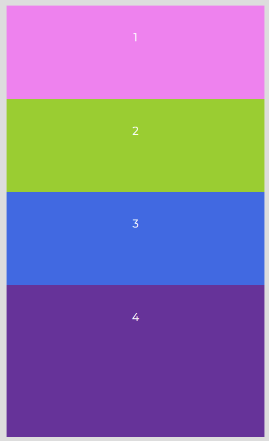

# CSS Flexbox Practice

## What i learned?

### Flexbox container properties

---

-   flex-direaction: row[defaut] | row-reverse | column | column-reverse;
-   flex-wrap: nowrap[default] | wrap | wrap-reverse;
-   flex-flow: column[flex-direction] wrap[flex-wrap];
-   justify-content: flex-start[default] | flex-end | center | space-between | space-around | space-evenly
-   align-items: stretch[default] | flex-start | flex-end | center | baseline
-   align-content: flex-start | flex-end | center | space-between | space-around | space-evenly | stretch[default]

### Flexbox item properties

---

-   order: [integer value] - default is 0
-   flex-grow: [integer value] - default 0
-   flex-shrink: [integer value] - default 1
-   flex-basis: [px, percentage, rem] - default auto
-   flex: [ flex-grow flex-shrink flex-basis ] - default is 0 1 auto,
-   align-self: auto[default] | flex-start | flex-end | center | baseline | stretch;

## What i Build

---

**Responsive Navigation Menu**

-   Desktop mode 
-   Mobile mode 

**Responsive Website layout model - 2**

-   Desktop mode 
-   mobile mode 

**Responsive Website layout model - 1**

-   Desktop mode 

-   Mobile mode 

_Note:_ To see the project code chek the different branch
